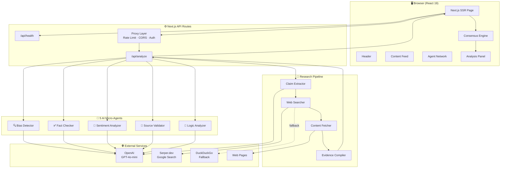
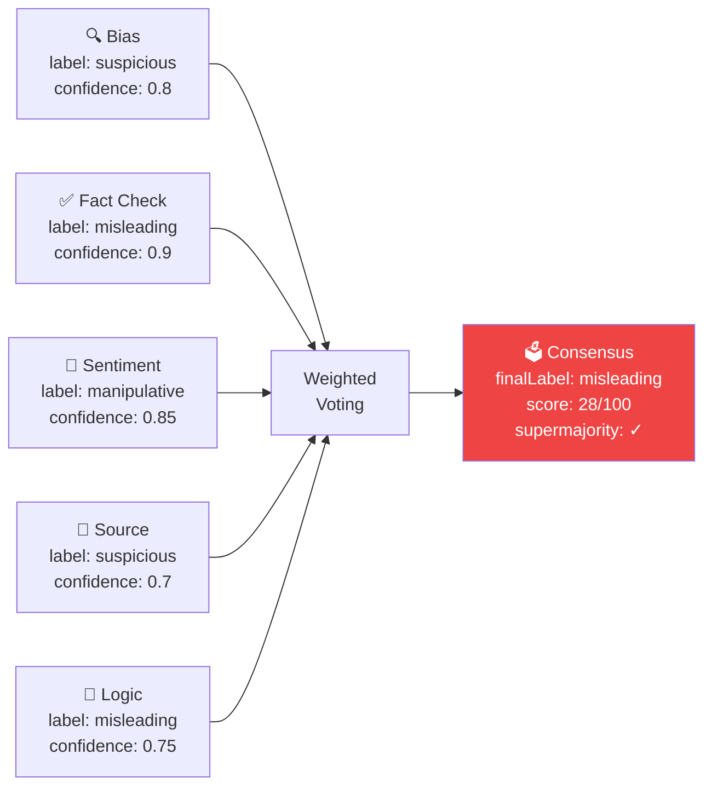
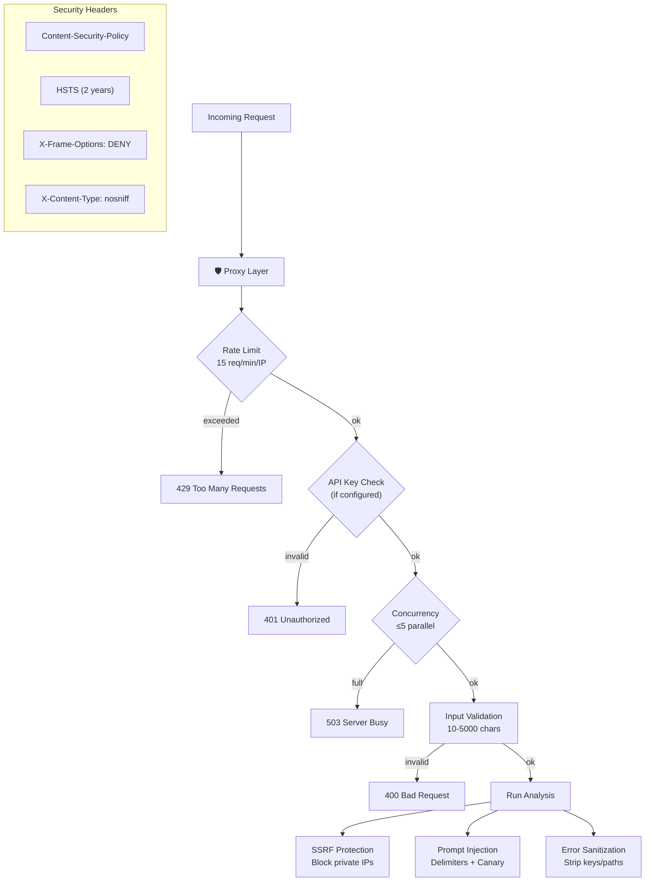

<div align="center">

# 👁️ Unveil — Multi-Agent AI Fact-Checking Platform

**An army of 5 specialized AI micro-agents collaborate using weighted consensus to automatically expose biased and fake content on social media.**

[](https://nextjs.org/)
[](https://openai.com/)
[](https://react.dev/)
[](LICENSE)

</div>

---

## 🎯 What Is Unveil?

Unveil takes any social media post or article and runs it through a **multi-agent AI pipeline** that:

1. **Extracts verifiable claims** using GPT-4o-mini
2. **Searches the web** for real evidence, classifying each source by trust level
3. **Deploys 5 specialized agents** (each with its own GPT-4o-mini prompt) in parallel
4. **Runs weighted consensus** to produce a final credibility verdict

The result is a detailed breakdown showing bias detection, fact verification, emotional manipulation analysis, source credibility scoring, and logical fallacy identification — all backed by real web evidence.

---

## 🏗️ System Architecture

### High-Level Overview



### Analysis Data Flow

```mermaid
sequenceDiagram
    participant U as 👤 User
    participant F as 🖥️ Frontend
    participant P as 🛡️ Proxy
    participant A as ⚙️ /api/analyze
    participant R as 🔬 Research
    participant L as 🤖 LLM Agents
    participant O as 🌐 OpenAI

    U->>F: Submit content
    F->>P: POST /api/analyze
    P->>P: Rate limit check
    P->>P: API key check
    P->>A: Forward request

    rect rgb(30, 30, 60)
        Note over A,R: Phase 1 — Web Research
        A->>R: runResearch(text)
        R->>O: Extract claims (GPT-4o-mini)
        O-->>R: Claims + search queries
        R->>R: Search web (Serper/DDG)
        R->>R: Fetch page content (SSRF-protected)
        R->>R: Compile evidence package
        R-->>A: Evidence text
    end

    rect rgb(30, 60, 30)
        Note over A,L: Phase 2 — Agent Analysis (parallel)
        A->>L: 5 agents in parallel
        L->>O: Bias Detector prompt + evidence
        L->>O: Fact Checker prompt + evidence
        L->>O: Sentiment Analyzer prompt + evidence
        L->>O: Source Validator prompt + evidence
        L->>O: Logic Analyzer prompt + evidence
        O-->>L: 5 JSON verdicts
        L->>L: Sanitize + canary check
        L-->>A: Verdicts array
    end

    A-->>F: { verdicts, research, timing, usage }
    F->>F: runConsensus(verdicts)
    F-->>U: Unveil Score + breakdown
```



---

## 🤖 The 5 Micro-Agents

Each agent is a GPT-4o-mini instance with a specialized system prompt and access to web research evidence:

| Agent | Icon | Role | What It Looks For |
|---|---|---|---|
| **Bias Detector** | 🔍 | Media bias analysis | Loaded language, one-sided framing, clickbait, cherry-picking |
| **Fact Checker** | ✅ | Factual verification | Cross-references claims with web evidence from trusted sources |
| **Sentiment Analyzer** | 💬 | Manipulation detection | Fear-mongering, outrage bait, urgency tactics, emotional exploitation |
| **Source Validator** | 🔗 | Source credibility | Checks cited sources, anonymous sourcing, source quality in web evidence |
| **Logic Analyzer** | 🧠 | Logical fallacy detection | Ad hominem, strawman, false dichotomy, slippery slope, hasty generalization |

### Consensus Mechanism



Each agent's vote is weighted by `trustScore × confidence`. The label with the highest weighted share wins. A **supermajority** (≥66%) indicates strong agreement.

### 🛡️ Tackling AI Bias & Hallucinations

LLMs inherently carry biases from their training data and can confidently hallucinate false information. Unveil mitigates this through a three-pronged defense architecture:

1. **Grounding in External Evidence (RAG):** The agents do not rely solely on their internal training weights. The Research Pipeline fetches live web evidence and injects it into their context window. Agents are strictly prompted to verify claims *against this external evidence* rather than relying on their own "beliefs."
2. **Specialized Narrow Personas:** Asking a single AI to "fact-check" a post often results in a subjective "vibe check." By fracturing the analysis into 5 narrow, rigidly defined personas (e.g., the *Logic Analyzer* ONLY looks for structural fallacies; the *Sentiment Analyzer* ONLY looks for emotional manipulation), the system prevents generalized ideological bias from dominating the result.
3. **Wisdom of the Crowd (Consensus):** A single agent might hallucinate or misinterpret a text due to bias, but the overall score is protected by the Consensus Engine. If the *Fact Checker* hallucinated a "Credible" verdict, but the *Sentiment Analyzer* flagged the text as "Manipulative" and the *Logic Analyzer* caught a "Strawman Fallacy," the consensus supermajority fails, appropriately dragging down the credibility score.

---

## 🛡️ Security Architecture



### Security Features

| Layer | Protection | Detail |
|---|---|---|
| **Proxy** | Rate limiting | 15 requests/min per IP, sliding window |
| **Proxy** | CORS | Origin whitelist (configurable) |
| **Proxy** | API key auth | Optional `X-API-Key` header |
| **API Route** | Concurrency | Max 5 parallel analyses |
| **API Route** | Input validation | 10–5000 character limit |
| **API Route** | Error sanitization | Strips API keys, paths, stack traces |
| **API Route** | Canary token | Detects prompt injection hijacking |
| **Research** | SSRF protection | Blocks private IPs, cloud metadata endpoints |
| **Research** | Fetch timeouts | 10s abort on all external requests |
| **Research** | Body size limit | 500KB max for fetched pages |
| **Prompts** | Injection defense | `<<<CONTENT>>>` delimiters, security rules in system prompt |
| **Config** | Security headers | CSP, HSTS, X-Frame-Options, Permissions-Policy |

---

## 📁 Project Structure

```
unveil/
├── src/
│   ├── app/
│   │   ├── layout.js              # Root layout + SEO metadata
│   │   ├── page.js                # Main page (React state management)
│   │   ├── globals.css            # Dark glassmorphism design system
│   │   └── api/
│   │       ├── analyze/route.js   # POST — Content analysis pipeline
│   │       └── health/route.js    # GET — Health check
│   │
│   ├── components/
│   │   ├── Header.js              # Network stats + status indicator
│   │   ├── ContentFeed.js         # Sample posts + custom input
│   │   ├── AgentNetwork.js        # Agent node visualization
│   │   └── AnalysisPanel.js       # Results (score ring, research, verdicts)
│   │
│   ├── lib/
│   │   ├── consensus.js           # Weighted voting consensus engine
│   │   ├── samplePosts.js         # 8 demo social media posts
│   │   ├── llm/
│   │   │   ├── openaiClient.js    # OpenAI SDK wrapper (singleton)
│   │   │   └── agentPrompts.js    # 5 agent system prompts
│   │   └── research/
│   │       ├── researchPipeline.js    # Pipeline orchestrator
│   │       ├── claimExtractor.js      # LLM-powered claim extraction
│   │       ├── webSearcher.js         # Serper.dev + DuckDuckGo fallback
│   │       ├── contentFetcher.js      # SSRF-protected page fetcher
│   │       └── evidenceCompiler.js    # Evidence packaging for prompts
│   │
│   └── proxy.js                   # Rate limiting, CORS, API key auth
│
├── .env.example                   # Environment template
├── next.config.mjs                # Security headers + config
└── package.json                   # Dependencies
```

---

## 🚀 Getting Started

### Prerequisites

- **Node.js 18+**
- **OpenAI API key** ([get one here](https://platform.openai.com/api-keys))
- **Serper.dev key** (optional, [free 2500 searches](https://serper.dev))

### Setup

```bash
# Clone the repository
git clone https://github.com/YOUR_USERNAME/unveil.git
cd unveil

# Install dependencies
npm install

# Configure environment
cp .env.example .env.local
# Edit .env.local and add your OPENAI_API_KEY

# Start development server
npm run dev
```

Open **http://localhost:3000** — click a post or paste custom content to analyze.

### Environment Variables

| Variable | Required | Default | Description |
|---|---|---|---|
| `OPENAI_API_KEY` | ✅ Yes | — | Powers all 5 AI agents |
| `OPENAI_MODEL` | No | `gpt-4o-mini` | OpenAI model to use |
| `SERPER_API_KEY` | No | — | Enables Google Search (falls back to DuckDuckGo) |
| `UNVEIL_API_KEY` | No | — | Require `X-API-Key` header on `/api/analyze` |

---

## 💰 Cost Estimation

Each analysis makes **6 GPT-4o-mini API calls** (1 for claim extraction + 5 agents):

| Per Analysis | Tokens | Cost |
|---|---|---|
| Prompt tokens | ~4,000–6,000 | ~$0.001–0.002 |
| Completion tokens | ~1,500–2,500 | ~$0.001–0.003 |
| **Total** | **~6,000–8,000** | **~$0.003–0.005** |

At current GPT-4o-mini pricing, **$1 gets you ~200-300 analyses**.

---

## 🧪 API Reference

### `POST /api/analyze`

Analyzes content for credibility, bias, and manipulation.

**Request:**
```json
{
  "text": "The content to analyze (10-5000 characters)"
}
```

**Response:**
```json
{
  "verdicts": [
    {
      "agentId": "fact-checker",
      "agentName": "Fact Checker",
      "label": "misleading",
      "confidence": 0.85,
      "flags": ["unsupported health claims", "no scientific sources"],
      "reasoning": "Analysis explanation... UNVEIL_INTEGRITY_OK",
      "integrityOk": true
    }
  ],
  "research": {
    "hasEvidence": true,
    "claimsFound": 3,
    "claims": ["..."],
    "sourceSummary": { "totalSources": 12, "trustedSources": 5 }
  },
  "timing": { "totalMs": 4200, "researchMs": 1800, "agentMs": 2400 },
  "usage": { "totalTokens": 7200 },
  "requestId": "req_m1abc_x9f2k3"
}
```

### `GET /api/health`

Returns system status and configuration.

---

## 🗺️ Roadmap

- [ ] Distributed consensus node network (for true decentralization)
- [ ] Browser extension for real-time social media analysis
- [ ] Additional agent specializations (financial, medical, political)
- [ ] Multi-language support
- [ ] Historical analysis tracking and pattern detection
- [ ] Community-driven agent training

---

## 📄 License

MIT License — see [LICENSE](LICENSE) for details.
